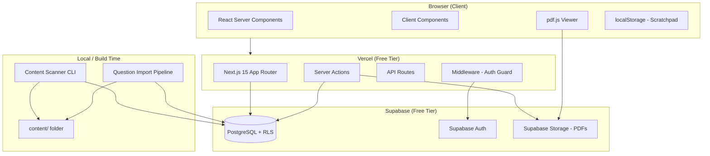
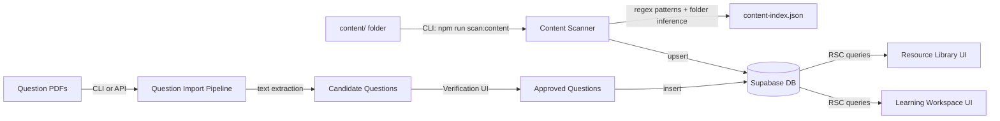
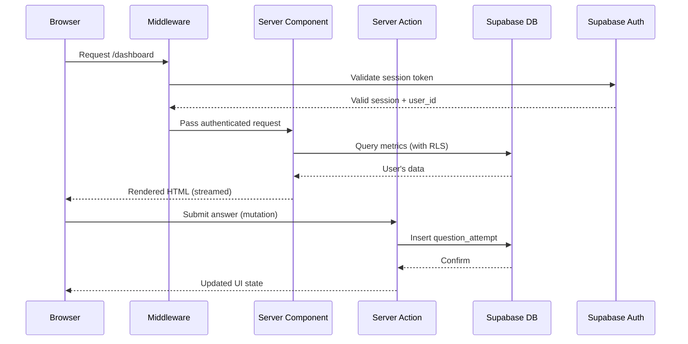
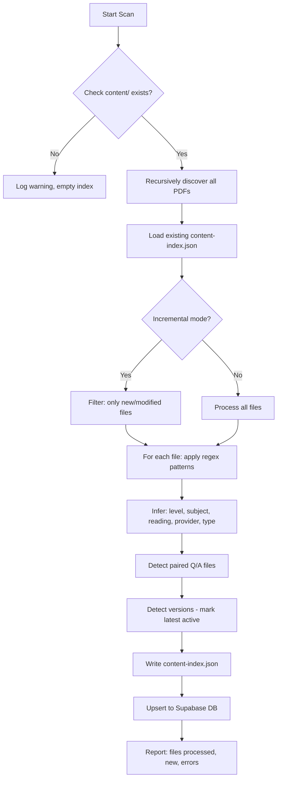
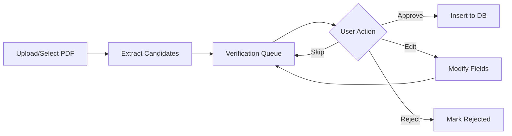

# Technical Design Document — CFA Buddy Phase 1

## Overview

CFA Buddy Phase 1 is a personal CFA exam study platform built on a zero-cost infrastructure stack. The platform ingests study materials from a local `content/` folder, indexes them via an automated scanner, and presents a unified study experience including a resource library, question bank, mistake tracking, and progress analytics.

**Key Architectural Decisions:**
- **Next.js 15 App Router** with React Server Components for zero-client-JS data fetching
- **Supabase** as the unified backend (PostgreSQL + Auth + Storage) on free tier
- **Feature-based architecture** for modularity across study modules
- **Content-first design** where the app adapts to the content/ folder dynamically
- **Prisma ORM** for type-safe database access with migration support
- **Server Actions** for all mutations (no REST API layer needed)

**Constraints:**
- All services must remain within free tier limits (Supabase 500MB DB, 1GB storage; Vercel 100GB bandwidth)
- No AI costs in Phase 1
- Single-user usage pattern with multi-user schema for future flexibility


## Architecture

### High-Level System Architecture




### Data Flow: Content Discovery Pipeline



### Request Flow




### Key Architectural Trade-offs

| Decision | Rationale | Trade-off |
|----------|-----------|-----------|
| Server Actions over REST | Eliminates API boilerplate, type-safe end-to-end | Less portable if migrating away from Next.js |
| Prisma over raw SQL | Type safety, migrations, schema-as-code | Slight performance overhead vs raw queries |
| Supabase RLS over app-level auth checks | Defense-in-depth, impossible to bypass | More complex policy management |
| Feature-based folders over layer-based | Scales better per module, self-contained features | Shared code extraction requires discipline |
| JSONB for answer_choices | Flexible answer counts per question level | Harder to query individual choices |
| localStorage for scratchpad | Zero server cost, instant writes | Lost if browser data cleared |
| Client-side PDF rendering | Zero server cost for viewing | Initial load time for large PDFs |

## Components and Interfaces

### Page Structure (Next.js App Router)

```
src/app/
├── (auth)/
│   ├── sign-in/page.tsx
│   ├── sign-up/page.tsx
│   └── layout.tsx              # Auth-page layout (no sidebar)
├── (protected)/
│   ├── dashboard/page.tsx
│   ├── learn/
│   │   ├── page.tsx            # Level selection
│   │   ├── [subjectId]/page.tsx
│   │   └── [subjectId]/[readingId]/page.tsx
│   ├── resources/
│   │   ├── page.tsx            # Browse hierarchy
│   │   └── [resourceId]/page.tsx  # PDF viewer
│   ├── questions/
│   │   ├── page.tsx            # Configure session
│   │   ├── session/[sessionId]/page.tsx  # Active test
│   │   └── review/[sessionId]/page.tsx   # Post-test review
│   ├── mistakes/page.tsx
│   ├── profile/page.tsx
│   ├── admin/
│   │   ├── scanner/page.tsx
│   │   └── import/page.tsx
│   └── layout.tsx              # Protected layout (sidebar + nav)
├── api/
│   ├── scanner/route.ts        # Trigger scan via API
│   └── search/route.ts         # Global search endpoint
├── layout.tsx                  # Root layout
└── page.tsx                    # Redirect to dashboard or sign-in
```


### Feature Module Structure

Each feature module follows this internal structure:

```
src/features/{feature-name}/
├── components/       # Feature-specific React components
├── actions/          # Server Actions for mutations
├── queries/          # Data fetching functions (for RSC)
├── hooks/            # Client-side hooks
├── utils/            # Feature-specific utilities
├── types/            # TypeScript types and Zod schemas
├── __tests__/        # Co-located tests
└── index.ts          # Public API barrel export
```

### Shared Infrastructure

```
src/shared/
├── components/       # shadcn/ui wrappers, layout primitives
├── hooks/            # useDebounce, useKeyboardShortcuts, useLocalStorage
├── lib/              # Supabase client, Prisma client, utils
├── types/            # Global types, enums
└── config/           # Environment config, constants
```

### Feature Modules

| Module | Responsibility |
|--------|---------------|
| `dashboard` | Hero metrics, advanced analytics, activity feed, onboarding state |
| `learning-workspace` | Topic navigation, provider tabs, notes CRUD, quick test launch |
| `resource-library` | PDF viewer, file browser, upload, page bookmarks |
| `question-bank` | Test configuration, active session, review flow, analytics |
| `mistake-book` | Error log, classification, pattern analytics, retest generation |
| `content-scanner` | CLI scanner, regex registry, subject mapping, status view |
| `exam-countdown` | Target setting, pacing computation, countdown display |
| `auth` | Sign-up, sign-in, sign-out, profile management |
| `search` | Global search modal, full-text query, result grouping |

### State Management Approach

- **Server State (reads):** React Server Components fetch data directly in `page.tsx` or layout components. No client-side caching library needed.
- **Server State (mutations):** Server Actions with `useActionState` for form submissions and optimistic updates.
- **Client State (ephemeral):** React `useState`/`useReducer` for UI state (modals, active tabs, filters).
- **Client State (persistent):** `localStorage` for theme preference, scratchpad content, incomplete form state.
- **URL State:** Search params for filter state, pagination cursors, active test mode — enables shareable/bookmarkable views.


### API Design

All mutations use **Server Actions** (no separate REST routes except for search and scanner trigger).

#### Auth (Server Actions in `src/features/auth/actions/`)

| Action | Input | Output | Notes |
|--------|-------|--------|-------|
| `signUp` | `{ email, password, displayName, level }` | `{ user } \| { error }` | Validates password rules, creates Supabase Auth user + DB profile |
| `signIn` | `{ email, password }` | `{ session } \| { error }` | Generic error on failure |
| `signOut` | none | redirect to `/sign-in` | Invalidates session |
| `updateProfile` | `{ displayName?, level? }` | `{ user } \| { error }` | Validates name length |

#### Dashboard (Queries in `src/features/dashboard/queries/`)

| Query | Parameters | Returns |
|-------|-----------|---------|
| `getHeroMetrics` | `userId` | `{ readiness, accuracy, streak, reviewDue, weakTopics[], weeklyProgress[] }` |
| `getAdvancedAnalytics` | `userId` | `{ estimatedScore, avgTime, strongTopics[], totals, confidenceCalibration }` |
| `getRecentActivity` | `userId, limit=5` | `ActivityEntry[]` |

#### Learning Workspace (Actions + Queries)

| Operation | Type | Path/Action | Shape |
|-----------|------|-------------|-------|
| Get hierarchy | Query | `getSubjects(levelId)` | `Subject[]` with reading counts |
| Get readings | Query | `getReadings(subjectId)` | `Reading[]` with progress |
| Get topic detail | Query | `getTopicDetail(topicId, userId)` | `{ concepts[], resources[], notes[], stats }` |
| Create note | Action | `createNote` | `{ topicId, conceptId?, content }` → `Note` |
| Update note | Action | `updateNote` | `{ noteId, content }` → `Note` |
| Delete note | Action | `deleteNote` | `{ noteId }` → `void` |

#### Resource Library (Actions + Queries)

| Operation | Type | Shape |
|-----------|------|-------|
| Browse resources | Query | `getResources(filters: { level, subject, reading, provider })` → `ContentResource[]` |
| Get resource detail | Query | `getResource(resourceId)` → `ContentResource & { signedUrl }` |
| Upload file | Action | `uploadResource({ file, subject, reading })` → `ContentResource` |
| Save page bookmark | Action | `savePageBookmark({ resourceId, pageNumber })` → `PageBookmark` |
| Get page bookmark | Query | `getPageBookmark(resourceId, userId)` → `number \| null` |

#### Question Bank (Actions + Queries)

| Operation | Type | Shape |
|-----------|------|-------|
| Create session | Action | `createSession({ mode, config })` → `{ sessionId, questions[] }` |
| Submit answer | Action | `submitAnswer({ sessionId, questionId, answer, confidence, timeSpent })` → `{ correct, attempt }` |
| Get session state | Query | `getSessionState(sessionId)` → `{ questions[], attempts[], flags[], bookmarks[] }` |
| Complete session | Action | `completeSession(sessionId)` → `{ summary, confidenceMatrix }` |
| Toggle bookmark | Action | `toggleQuestionBookmark({ questionId })` → `boolean` |
| Toggle flag | Action | `toggleFlag({ sessionId, questionId })` → `boolean` |
| Add question note | Action | `addQuestionNote({ questionId, content })` → `Note` |
| Get analytics | Query | `getQuestionAnalytics(userId, filters)` → `AnalyticsSummary` |
| Resume session | Query | `getIncompleteSession(userId)` → `Session \| null` |

#### Mistake Book (Actions + Queries)

| Operation | Type | Shape |
|-----------|------|-------|
| Get mistakes | Query | `getMistakes(userId, filters)` → `MistakeEntry[]` |
| Classify error | Action | `classifyError({ attemptId, classification })` → `MistakeLog` |
| Update classification | Action | `updateClassification({ mistakeId, classification })` → `MistakeLog` |
| Generate retest | Action | `generateRetest({ filters, count })` → `{ sessionId }` |
| Get error analytics | Query | `getErrorAnalytics(userId)` → `{ breakdown, trends, dominant }` |

#### Content Scanner (API Route + CLI)

| Operation | Type | Path |
|-----------|------|------|
| Trigger scan | POST | `/api/scanner` → `{ status, filesProcessed, newFiles }` |
| Get scan status | GET | `/api/scanner` → `{ lastScan, totalFiles, byType, byProvider }` |

#### Search (API Route)

| Operation | Type | Path |
|-----------|------|------|
| Full-text search | GET | `/api/search?q={query}` → `{ notes[], questions[], resources[], topics[] }` |

#### Exam Countdown (Actions + Queries)

| Operation | Type | Shape |
|-----------|------|-------|
| Set target | Action | `setExamTarget({ date, level })` → `ExamTarget` |
| Get pacing | Query | `getPacing(userId)` → `{ daysLeft, topicsPerDay, questionsPerDay, weeklyTarget, status }` |


## Data Models

### Database Entity Relationship Diagram

```mermaid
erDiagram
    User {
        uuid id PK
        text display_name
        text auth_user_id UK
        enum level "I, II, III"
        timestamp created_at
        timestamp updated_at
    }

    Level {
        uuid id PK
        text name "I, II, III"
        int sort_order
    }

    Subject {
        uuid id PK
        uuid level_id FK
        text name
        text abbreviation
        int sort_order
        decimal weight "CFA curriculum weighting"
    }

    Reading {
        uuid id PK
        uuid subject_id FK
        text name
        int reading_number
        int sort_order
    }

    Topic {
        uuid id PK
        uuid reading_id FK
        text name
        text los_code "Learning Outcome Statement"
        int sort_order
    }

    Concept {
        uuid id PK
        uuid topic_id FK
        text name "max 100 chars"
        text description "max 500 chars, nullable"
        timestamp created_at
    }

    Content_Provider {
        uuid id PK
        text name UK
        text slug UK
        text description
    }

    Content_Resource {
        uuid id PK
        uuid level_id FK
        uuid subject_id FK "nullable"
        uuid reading_id FK "nullable"
        uuid provider_id FK "nullable"
        text file_path
        enum content_type "pdf, video-link, formula-sheet, unknown"
        bigint file_size_bytes
        text version "nullable"
        boolean active "default true"
        timestamp discovered_at
    }

    Question {
        uuid id PK
        uuid concept_id FK
        uuid topic_id FK
        uuid provider_id FK
        text question_text
        jsonb answer_choices "array of {label, text, is_correct, explanation}"
        enum difficulty "Easy, Medium, Hard"
        text question_source_file
        timestamp created_at
    }

    Question_Session {
        uuid id PK
        uuid user_id FK
        enum mode "topic, subject, mixed, quick, adaptive, random, weak"
        jsonb config "question_count, time_limit, filters"
        enum status "active, completed, abandoned"
        timestamp started_at
        timestamp completed_at "nullable"
        int total_questions
        timestamp expires_at "started_at + 7 days"
    }

    Question_Attempt {
        uuid id PK
        uuid session_id FK
        uuid question_id FK
        uuid user_id FK
        text selected_answer
        enum confidence "Guess, Think So, Certain"
        int time_spent_seconds
        boolean correct
        enum error_classification "nullable"
        timestamp created_at
    }

    Note {
        uuid id PK
        uuid user_id FK
        uuid topic_id FK "nullable"
        uuid concept_id FK "nullable"
        uuid question_id FK "nullable"
        text content "max 50000 chars"
        timestamp created_at
        timestamp updated_at
    }

    Formula {
        uuid id PK
        uuid concept_id FK
        uuid provider_id FK "nullable"
        text content "supports math notation"
        timestamp created_at
    }

    Flashcard {
        uuid id PK
        uuid concept_id FK
        uuid user_id FK
        text front
        text back
        date next_review
        int interval_days
        decimal ease_factor
        timestamp created_at
    }

    Progress {
        uuid id PK
        uuid user_id FK
        uuid topic_id FK
        int mastery_level "0-100"
        int questions_attempted
        int questions_correct
        timestamp last_studied
    }

    Study_Streak {
        uuid id PK
        uuid user_id FK UK
        int current_streak
        int longest_streak
        date streak_start_date
        date last_study_date
    }

    Exam_Target {
        uuid id PK
        uuid user_id FK UK
        date target_date
        enum target_level "I, II, III"
        timestamp created_at
    }

    Mistake_Log {
        uuid id PK
        uuid attempt_id FK
        uuid user_id FK
        uuid concept_id FK
        uuid topic_id FK
        enum error_classification
        enum confidence
        boolean resolved "default false"
        int repeat_count "default 0"
        boolean persistent_weakness "default false"
        timestamp created_at
    }

    Question_Bookmark {
        uuid id PK
        uuid user_id FK
        uuid question_id FK
        timestamp created_at
    }

    Note_Bookmark {
        uuid id PK
        uuid user_id FK
        uuid note_id FK
        timestamp created_at
    }

    Resource_Bookmark {
        uuid id PK
        uuid user_id FK
        uuid resource_id FK
        timestamp created_at
    }

    Page_Bookmark {
        uuid id PK
        uuid user_id FK
        uuid resource_id FK
        int page_number
        timestamp updated_at
    }

    %% Relationships
    Subject ||--o{ Reading : contains
    Level ||--o{ Subject : contains
    Reading ||--o{ Topic : contains
    Topic ||--o{ Concept : contains

    Concept ||--o{ Question : references
    Concept ||--o{ Note : "linked via"
    Concept ||--o{ Formula : has
    Concept ||--o{ Flashcard : has
    Concept ||--o{ Mistake_Log : references

    Content_Provider ||--o{ Content_Resource : provides
    Content_Provider ||--o{ Question : sources

    User ||--o{ Note : owns
    User ||--o{ Question_Attempt : records
    User ||--o{ Question_Session : creates
    User ||--o{ Progress : tracks
    User ||--|| Study_Streak : has
    User ||--|| Exam_Target : sets
    User ||--o{ Flashcard : owns
    User ||--o{ Mistake_Log : owns
    User ||--o{ Question_Bookmark : owns
    User ||--o{ Note_Bookmark : owns
    User ||--o{ Resource_Bookmark : owns
    User ||--o{ Page_Bookmark : owns

    Question_Session ||--o{ Question_Attempt : contains
    Question ||--o{ Question_Attempt : answered_by
    Question_Attempt ||--o| Mistake_Log : generates
```


### Key Database Design Decisions

**Indexes:**
- `Progress`: unique composite index on `(user_id, topic_id)`
- `Study_Streak`: unique index on `user_id`
- `Exam_Target`: unique index on `user_id`
- `Question_Bookmark`: unique composite on `(user_id, question_id)`
- `Note_Bookmark`: unique composite on `(user_id, note_id)`
- `Resource_Bookmark`: unique composite on `(user_id, resource_id)`
- `Page_Bookmark`: unique composite on `(user_id, resource_id)`
- `Question_Attempt`: index on `(user_id, created_at)` for analytics queries
- `Mistake_Log`: index on `(user_id, error_classification)` for pattern analysis
- `Content_Resource`: index on `(level_id, subject_id, provider_id)` for hierarchy browsing
- `Question`: index on `(topic_id, concept_id)` for session creation
- GIN index on `search_vector` columns for full-text search (Notes, Questions, Topics, Readings)

**Row-Level Security Policies:**
All user-owned entities enforce `auth.uid() = user_id` for SELECT, INSERT, UPDATE, DELETE.
Shared entities (Level, Subject, Reading, Topic, Concept, Content_Resource, Content_Provider, Question, Formula) are readable by all authenticated users.

**Cascade Deletes:**
- `Level` → `Subject` → `Reading` → `Topic` → `Concept` (full hierarchy cascade)
- `User` deletion cascades to all user-owned entities
- `Question_Attempt` deletion cascades to `Mistake_Log`

**JSONB answer_choices schema:**
```typescript
type AnswerChoice = {
  label: string;      // "A", "B", "C", etc.
  text: string;       // Answer text content
  is_correct: boolean;
  explanation: string; // Why this is correct/incorrect
};
// Question.answer_choices: AnswerChoice[] (typically 3 for L1, variable for L2)
```


### Content Scanner Design

#### CLI Architecture

The scanner runs as `npm run scan:content` (Node.js script in `src/scripts/scan-content.ts`).



#### Regex Pattern Registry

Configurable patterns stored in `src/features/content-scanner/config/patterns.ts`:

```typescript
type PatternConfig = {
  provider: string;
  pathPattern: RegExp;      // Match on folder path
  filenamePattern: RegExp;  // Match on filename
  extractor: (match: RegExpMatchArray, path: string) => Partial<ContentMetadata>;
};

// Examples:
const patterns: PatternConfig[] = [
  {
    provider: 'curriculum',
    pathPattern: /curriculum\/level(\d)/,
    filenamePattern: /cfa-program(\d{4})L(\d)V(\d+)-(\w+)\.pdf/,
    extractor: (match) => ({
      year: match[1], level: match[2], volume: match[3], subjectAbbr: match[4]
    })
  },
  {
    provider: 'ift',
    pathPattern: /notes\/level\d\/ift/,
    filenamePattern: /LM(\d{2})\s+(.+)\s+IFT Notes\.pdf/,
    extractor: (match) => ({
      readingNumber: match[1], readingTitle: match[2]
    })
  },
  // ... additional patterns per provider
];
```

#### Subject Mapping Configuration

```typescript
const subjectMapping: Record<string, string> = {
  'QM': 'Quantitative Methods', 'Quants': 'Quantitative Methods',
  'Eco': 'Economics', 'CI': 'Corporate Issuers',
  'FSA': 'Financial Statement Analysis',
  'Equity': 'Equity Investments', 'FI': 'Fixed Income',
  'Deriv': 'Derivatives', 'AI': 'Alternative Investments',
  'PM': 'Portfolio Management', 'Ethics': 'Ethical and Professional Standards',
};
```

#### Incremental Scanning

- Store `last_scan_timestamp` in `content/metadata/scan-state.json`
- On subsequent runs, compare file `mtime` against last scan
- Only process files with newer timestamps or files not in existing index
- Full rescan available via `--full` flag

#### Version Detection

- Extract year from filename patterns (e.g., `2024`, `2025`, `2026`)
- Group files by same provider + subject + reading
- Mark highest year as `active = true`
- Older versions: `active = false` (retained for reference)

#### Paired File Detection

- Detect pairs by matching filenames differing only by ` - Answers` suffix
- Store pair relationship in content-index: `{ questionFile, answerFile }`


### Question Import Pipeline Design

#### Text Extraction Strategy

Use `pdf-parse` (Node.js library) for text extraction from PDFs:
1. Load PDF buffer
2. Extract text page-by-page
3. Apply question boundary detection

#### Question Parsing Algorithm

```typescript
type ParsedQuestion = {
  questionNumber: number;
  text: string;
  choices: { label: string; text: string }[];
  readingNumber?: number;
  pageNumber: number;
};

// Boundary detection heuristics:
// 1. Question starts with number pattern: "1.", "Q1.", "Question 1"
// 2. Choices start with letter pattern: "A.", "B.", "C." or "a)", "b)", "c)"
// 3. Explanation starts with: "Explanation:", "Answer:", "Correct Answer:"
```

#### Paired File Correlation

For matched Q+A files:
1. Parse questions from question file → `ParsedQuestion[]`
2. Parse answers from answer file → `ParsedAnswer[]` (correct label + explanation)
3. Correlate by `questionNumber` within each reading section
4. Merge into complete `QuestionCandidate` records

#### Verification UI Flow



#### Provenance Tracking

Every imported question stores:
- `question_source_file`: originating PDF filename
- `extraction_timestamp`: when text extraction ran
- `verification_status`: pending | approved | rejected
- `verified_by`: user_id who approved

### Search Architecture

#### PostgreSQL Full-Text Search

Add `search_vector` (tsvector) column to searchable tables:
- `Note.search_vector` — generated from `content`
- `Question.search_vector` — generated from `question_text`
- `Topic.search_vector` — generated from `name`
- `Reading.search_vector` — generated from `name`
- `Content_Resource.search_vector` — generated from `file_path`

#### GIN Indexes

```sql
CREATE INDEX idx_note_search ON note USING GIN (search_vector);
CREATE INDEX idx_question_search ON question USING GIN (search_vector);
CREATE INDEX idx_topic_search ON topic USING GIN (search_vector);
CREATE INDEX idx_reading_search ON reading USING GIN (search_vector);
CREATE INDEX idx_resource_search ON content_resource USING GIN (search_vector);
```

#### Search Vector Update Triggers

```sql
CREATE OR REPLACE FUNCTION update_note_search_vector() RETURNS trigger AS $$
BEGIN
  NEW.search_vector := to_tsvector('english', COALESCE(NEW.content, ''));
  RETURN NEW;
END; $$ LANGUAGE plpgsql;

CREATE TRIGGER note_search_update BEFORE INSERT OR UPDATE ON note
  FOR EACH ROW EXECUTE FUNCTION update_note_search_vector();
```

#### Client-Side Search UX

- Debounced input (300ms after last keystroke)
- Parallel queries across all searchable tables
- Results grouped by type, ranked by `ts_rank`
- Maximum 5 per group, expandable
- Keyboard shortcut: Cmd/Ctrl+K opens modal


### Performance & Optimization Strategy

| Strategy | Implementation | Impact |
|----------|---------------|--------|
| RSC for data fetching | All list/detail pages render server-side | Zero client-side fetch waterfalls |
| Streaming | `loading.tsx` + Suspense boundaries | Instant perceived load |
| PDF lazy rendering | Page-at-a-time with react-pdf | Handles 6000-page docs |
| Static generation | Level/Subject/Reading hierarchy via ISR | Near-instant navigation |
| Cursor pagination | All list queries use cursor-based pagination | Consistent performance at scale |
| DB indexes | Composite indexes on common query patterns | Sub-100ms queries |
| Debounced search | 300ms debounce on keystrokes | Reduces DB load |
| Image optimization | next/image for any UI images | Automatic compression |
| Bundle splitting | Per-feature dynamic imports | Small initial JS bundle |

#### Caching Strategy

- **ISR (Incremental Static Regeneration)**: Content hierarchy pages (subjects, readings) — revalidate every 1 hour
- **No-cache**: User-specific data (progress, attempts, notes) — always fresh
- **SWR-like**: Question analytics — stale-while-revalidate with 5-minute window
- **localStorage**: Theme preference, scratchpad, keyboard shortcut preferences

### Deployment Architecture

#### Vercel Configuration

```json
// vercel.json
{
  "framework": "nextjs",
  "buildCommand": "prisma generate && next build",
  "installCommand": "npm install",
  "regions": ["iad1"]
}
```

#### Environment Variables

```
# Supabase
NEXT_PUBLIC_SUPABASE_URL=
NEXT_PUBLIC_SUPABASE_ANON_KEY=
SUPABASE_SERVICE_ROLE_KEY=

# Prisma
DATABASE_URL=                    # Supabase connection pooler URL

# App
NEXT_PUBLIC_APP_URL=
CONTENT_BASE_PATH=./content     # Local path to content folder
```

#### Database Migration Strategy

1. Define schema in `prisma/schema.prisma`
2. Run `prisma migrate dev` locally for development
3. Run `prisma migrate deploy` in CI/CD for production
4. Seed curriculum hierarchy data via `prisma/seed.ts`

#### Content Serving

- **Development**: Serve PDFs from local `content/` folder via Next.js API route
- **Production**: Upload to Supabase Storage bucket with signed URLs (1-hour expiry)
- **Transition**: Scanner can optionally upload discovered files to Storage during scan

### Folder Structure (Complete)

```
src/
├── app/
│   ├── (auth)/
│   ├── (protected)/
│   ├── api/
│   ├── globals.css
│   ├── layout.tsx
│   └── page.tsx
├── features/
│   ├── auth/
│   ├── dashboard/
│   ├── learning-workspace/
│   ├── resource-library/
│   ├── question-bank/
│   ├── mistake-book/
│   ├── content-scanner/
│   ├── exam-countdown/
│   └── search/
├── shared/
│   ├── components/
│   │   ├── ui/            # shadcn/ui components
│   │   ├── layout/        # Sidebar, Header, Nav
│   │   └── feedback/      # Toast, Error boundary, Loading
│   ├── hooks/
│   ├── lib/
│   │   ├── supabase/      # Client creation, helpers
│   │   ├── prisma/        # Prisma client singleton
│   │   └── utils/         # formatDate, cn(), etc.
│   ├── types/
│   └── config/
├── scripts/
│   ├── scan-content.ts
│   ├── import-questions.ts
│   └── seed-curriculum.ts
├── middleware.ts           # Auth guard
└── env.ts                  # Zod-validated env schema
```


### Security Design

#### Row-Level Security (RLS) Policies

Every user-owned table gets these policies:
```sql
-- Example for Note table
ALTER TABLE note ENABLE ROW LEVEL SECURITY;

CREATE POLICY "Users can view own notes" ON note
  FOR SELECT USING (auth.uid() = user_id);

CREATE POLICY "Users can insert own notes" ON note
  FOR INSERT WITH CHECK (auth.uid() = user_id);

CREATE POLICY "Users can update own notes" ON note
  FOR UPDATE USING (auth.uid() = user_id);

CREATE POLICY "Users can delete own notes" ON note
  FOR DELETE USING (auth.uid() = user_id);
```

Applied to: Note, Question_Attempt, Question_Session, Progress, Study_Streak, Exam_Target, Flashcard, Mistake_Log, all Bookmark tables.

#### Input Validation (Zod Schemas)

Every Server Action validates input with Zod before database interaction:
```typescript
const createNoteSchema = z.object({
  topicId: z.string().uuid(),
  conceptId: z.string().uuid().optional(),
  content: z.string().min(1).max(50_000),
});
```

#### File Upload Validation

- Maximum size: 100MB
- Allowed MIME types: `application/pdf` only
- File header magic byte check (PDF starts with `%PDF`)
- Stored in user-specific Storage bucket path: `{user_id}/{filename}`

#### CSRF Protection

- Server Actions are inherently CSRF-protected (POST-only, origin-verified by Next.js)
- API routes use Supabase session validation

#### Rate Limiting

- Vercel's built-in DDoS protection on free tier
- Consider adding per-user rate limits in middleware if abuse detected (Phase 2)

### Free Tier Budget Analysis

| Service | Limit | Estimated Usage (Single User) | Headroom |
|---------|-------|-------------------------------|----------|
| **Supabase DB** | 500MB | ~50MB (schema + 10K questions + progress) | 90% free |
| **Supabase Storage** | 1GB | ~500MB (uploaded personal PDFs) | 50% free |
| **Supabase Auth** | 50K MAU | 1 user | 99.99% free |
| **Supabase Bandwidth** | 5GB/month | ~2GB (PDF serving) | 60% free |
| **Vercel Bandwidth** | 100GB | ~5GB (page loads + assets) | 95% free |
| **Vercel Functions** | 100K invocations | ~10K/month (actions + API) | 90% free |
| **Vercel Build** | 6000 min/month | ~30 min/month (deploys) | 99% free |

**Content serving note:** Large PDFs (curriculum volumes ~200MB each) should remain local in development. For production, only user-uploaded PDFs go to Supabase Storage. Curriculum PDFs are served via Next.js API route from the filesystem on Vercel (included in the deployment bundle is not feasible for large files — recommend Supabase Storage with selective upload of frequently-accessed files only).

**Mitigation for Storage limits:**
- Only upload user's personal PDFs to Supabase Storage
- Curriculum/provider PDFs served from local filesystem in dev
- For production: host on Supabase Storage with lazy upload (only when first accessed) or link externally


## Correctness Properties

*A property is a characteristic or behavior that should hold true across all valid executions of a system — essentially, a formal statement about what the system should do. Properties serve as the bridge between human-readable specifications and machine-verifiable correctness guarantees.*

### Property 1: Answer Choices JSONB Round-Trip

*For any* valid `answer_choices` array (containing objects with label, text, is_correct, and explanation fields, with variable length from 2 to 6 choices), serializing to JSONB and deserializing back SHALL produce an equivalent array with all fields preserved.

**Validates: Requirements 2.6, 2.20**

### Property 2: Auth Input Validation

*For any* string, the password validation function SHALL accept it if and only if it has length >= 8 AND contains at least one uppercase letter AND contains at least one lowercase letter AND contains at least one digit. *For any* string, the display name validation function SHALL accept it if and only if its length is between 1 and 50 characters inclusive.

**Validates: Requirements 3.1, 3.8**

### Property 3: Exam Readiness Computation Bounds

*For any* valid set of inputs (topic mastery levels each in [0,100], overall accuracy in [0,100]%, study streak >= 0), the computed Exam_Readiness metric SHALL always produce a value in the range [0, 100] inclusive.

**Validates: Requirements 4.1**


### Property 4: Study Streak Computation

*For any* chronologically ordered sequence of study activity timestamps, the computed current streak SHALL equal the count of consecutive calendar days (in the user's timezone) ending on the most recent activity day. Adding a new activity on the next consecutive day SHALL increase the streak by exactly 1; adding an activity on a non-consecutive future day SHALL reset the streak to 1.

**Validates: Requirements 4.3**

### Property 5: Analytics Metrics Produce Valid Bounded Outputs

*For any* set of question attempts with valid fields (time_spent >= 0, correct is boolean, confidence is a valid enum), the following computations SHALL produce valid outputs: overall accuracy is in [0, 100]%, average time per question is >= 0, estimated exam score (weighted by curriculum weights summing to 1.0) is in [0, 100]%, and confidence calibration (certain-and-correct / total-certain) is in [0, 100]%.

**Validates: Requirements 4.2, 4.8, 4.9, 4.12**

### Property 6: Confidence Matrix Classification

*For any* question attempt with a correctness value (true/false) and a confidence rating (Guess, Think So, Certain), the Confidence Matrix SHALL classify it into exactly one of six categories: Mastered (Correct+Certain), Solid (Correct+Think So), Lucky Guess (Correct+Guess), Misconception (Incorrect+Certain), Weak Area (Incorrect+Think So), Knowledge Gap (Incorrect+Guess). The classification SHALL be exhaustive (every valid input maps to exactly one category) and deterministic (same input always produces same category).

**Validates: Requirements 7.20**

### Property 7: Adaptive Retest Question Selection

*For any* user's attempt history, the Adaptive Retest selection algorithm SHALL return only questions that satisfy at least one of: (a) previously answered incorrectly, (b) time spent exceeded the user's average by more than 50%, or (c) confidence rating was Guess. The result set SHALL contain no duplicates.

**Validates: Requirements 7.5**


### Property 8: Question Filter Composition (Intersection)

*For any* set of questions and any combination of simultaneously applied filters (difficulty, provider, topic, subject, completion status, bookmark status, time performance, confidence-correctness category), the result SHALL equal the intersection of applying each filter individually. That is, every question in the result satisfies ALL active filter criteria, and no question satisfying all criteria is excluded.

**Validates: Requirements 7.26**

### Property 9: Search Result Grouping

*For any* set of search results with associated content types (Notes, Questions, Resources, Topics), the grouping function SHALL partition results into exactly these four groups with no result appearing in multiple groups, each group containing at most 5 results, and no result being lost (sum of group sizes equals min(total results, 20)).

**Validates: Requirements 8.3**

### Property 10: Error Analytics Percentages

*For any* non-empty collection of classified mistakes, the computed error type breakdown percentages SHALL all be non-negative AND sum to 100% (within floating-point tolerance). The dominant error pattern SHALL be the category with the highest count over the most recent 30 days.

**Validates: Requirements 10.8, 10.10**

### Property 11: Mistake Retest Generation

*For any* mistake log and applied filters (error classification, count limit), the generated retest session SHALL contain only questions matching all active filters, SHALL not exceed the specified count limit (between 5 and 100), and SHALL contain no duplicate questions.

**Validates: Requirements 10.12**


### Property 12: Repeat Count and Persistent Weakness Flag

*For any* question that a user answers incorrectly on N separate occasions (N >= 1), the repeat_count on that question's mistake entry SHALL equal N-1 (incremented on each subsequent incorrect attempt after the first). The persistent_weakness flag SHALL be true if and only if repeat_count >= 3.

**Validates: Requirements 10.14**

### Property 13: Content Scanner Metadata Extraction

*For any* filename conforming to a registered regex pattern (curriculum, IFT, Mark Meldrum, Fintree, Schweser, UWorld), the metadata extraction function SHALL produce a non-null provider, and SHALL correctly extract the level, subject abbreviation, and reading number (where applicable) matching the encoded values in the filename. *For any* file path containing a known provider folder segment, the provider inference function SHALL return that provider name.

**Validates: Requirements 11.2, 11.3, 11.4**

### Property 14: Incremental Scan File Selection

*For any* set of files with modification timestamps and a last_scan_timestamp, the incremental scan filter SHALL select exactly those files whose modification timestamp is strictly greater than last_scan_timestamp OR whose path does not appear in the existing index. No file meeting neither condition SHALL be selected.

**Validates: Requirements 11.6**

### Property 15: Version Detection

*For any* set of content resources grouped by (provider, subject, reading), after version detection runs, exactly one resource in each group SHALL have active=true (the one with the highest year identifier), and all others SHALL have active=false. If a group has only one resource, it SHALL be marked active regardless of year.

**Validates: Requirements 11.7**


### Property 16: Paired File Detection

*For any* set of filenames, the paired file detection function SHALL identify a pair (A, B) if and only if B equals A with " - Answers" appended before the file extension. Every detected pair SHALL consist of exactly two files. No file SHALL appear in more than one pair.

**Validates: Requirements 11.9**

### Property 17: Question Boundary Parsing

*For any* text block containing N questions delimited by sequential numeric patterns (e.g., "1.", "2.", ..., "N.") each followed by lettered answer choices (e.g., "A.", "B.", "C."), the parsing function SHALL extract exactly N question objects, each with the correct question text and the correct set of answer choices preserving order.

**Validates: Requirements 12.2**

### Property 18: Pacing Computation and Classification

*For any* valid inputs where days_remaining > 0 and topics_remaining >= 0 and unanswered_questions >= 0: (a) topics_per_day SHALL equal topics_remaining / days_remaining, (b) questions_per_day SHALL equal unanswered_questions / days_remaining, (c) weekly_target SHALL equal questions_per_day * 7. Furthermore, *for any* actual_weekly_progress and weekly_target where weekly_target > 0, the pacing indicator SHALL be "ahead" if actual/target > 1.1, "on track" if 0.9 <= actual/target <= 1.1, and "behind" if actual/target < 0.9.

**Validates: Requirements 13.3, 13.4, 13.5, 13.6**


## Error Handling

### Error Handling Strategy

| Layer | Strategy | Implementation |
|-------|----------|---------------|
| **Client (forms)** | Optimistic UI with rollback | `useActionState` + error toast on failure |
| **Server Actions** | Zod validation + try/catch | Return `{ error: string }` on validation failure, throw on unexpected errors |
| **Database** | Prisma error handling | Catch `PrismaClientKnownRequestError` for constraint violations, return user-friendly messages |
| **Auth** | Generic error messages | Never reveal whether email exists (sign-in); specific field errors (sign-up) |
| **File upload** | Size + type validation | Reject before upload attempt, retry on network failure |
| **PDF rendering** | Graceful degradation | Show error message + retry button on load failure |
| **Network** | Retry with backoff | Auto-retry failed mutations up to 3 times with exponential backoff |
| **Search** | Graceful fallback | Show "search unavailable" message, allow retry |
| **Scanner** | Continue on file error | Log warning per file, continue processing remaining files |

### Error Boundary Hierarchy

```
RootErrorBoundary (app/error.tsx)
├── AuthErrorBoundary (catches auth redirect issues)
├── FeatureErrorBoundary (per-feature error.tsx files)
│   ├── DashboardError → "Could not load metrics" + retry
│   ├── QuestionBankError → "Could not load questions" + retry
│   ├── ResourceLibraryError → "Could not load resource" + retry
│   └── MistakeBookError → "Could not load mistakes" + retry
└── ComponentErrorBoundary (wraps individual widgets)
```

### Offline/Network Resilience

- **Scratchpad**: Always available (localStorage), no network needed
- **Error classification queue**: Store locally if network fails, retry on reconnect
- **PDF viewing**: Once loaded, works offline (client-side rendering)
- **Theme preference**: localStorage, no network dependency
- **Session auto-save**: Queue mutations if offline, flush on reconnect (7-day session expiry)

### Validation Error Responses

All Server Actions return a discriminated union:
```typescript
type ActionResult<T> =
  | { success: true; data: T }
  | { success: false; error: string; fieldErrors?: Record<string, string[]> };
```


## Testing Strategy

### Dual Testing Approach

CFA Buddy Phase 1 uses a complementary testing strategy:

1. **Property-Based Tests** — Verify universal correctness guarantees across all valid inputs using generated data (100+ iterations per property)
2. **Unit Tests (Example-Based)** — Verify specific behaviors, edge cases, integration points, and error conditions with concrete examples
3. **Integration Tests** — Verify database operations, auth flows, RLS policies, and file upload/download with real Supabase connections

### Property-Based Testing Configuration

- **Library**: [fast-check](https://github.com/dubzzz/fast-check) (TypeScript property-based testing)
- **Runner**: Vitest
- **Minimum iterations**: 100 per property
- **Tag format**: `Feature: cfa-buddy-phase1, Property {N}: {property_text}`

Each correctness property from the design document maps to a single property-based test:

| Property | Test File Location | Key Generators |
|----------|-------------------|----------------|
| 1: JSONB Round-Trip | `features/question-bank/__tests__/answer-choices.property.test.ts` | Random arrays of {label, text, is_correct, explanation} |
| 2: Auth Validation | `features/auth/__tests__/validation.property.test.ts` | Random strings with controlled character composition |
| 3: Readiness Bounds | `features/dashboard/__tests__/readiness.property.test.ts` | Random mastery arrays, accuracy floats, streak ints |
| 4: Streak Computation | `features/dashboard/__tests__/streak.property.test.ts` | Random date sequences |
| 5: Analytics Bounds | `features/dashboard/__tests__/analytics.property.test.ts` | Random attempt arrays |
| 6: Confidence Matrix | `features/question-bank/__tests__/confidence-matrix.property.test.ts` | All (boolean × enum) combinations + random arrays |
| 7: Adaptive Retest | `features/question-bank/__tests__/adaptive-retest.property.test.ts` | Random attempt histories with varied times/confidence |
| 8: Filter Composition | `features/question-bank/__tests__/filter-composition.property.test.ts` | Random question sets + random filter combinations |
| 9: Search Grouping | `features/search/__tests__/grouping.property.test.ts` | Random result arrays with type metadata |
| 10: Error Percentages | `features/mistake-book/__tests__/error-analytics.property.test.ts` | Random mistake distributions |
| 11: Retest Generation | `features/mistake-book/__tests__/retest-generation.property.test.ts` | Random mistake logs + filter configs |
| 12: Repeat Count | `features/mistake-book/__tests__/repeat-count.property.test.ts` | Random sequences of attempts on same question |
| 13: Scanner Extraction | `features/content-scanner/__tests__/metadata-extraction.property.test.ts` | Generated filenames conforming to patterns |
| 14: Incremental Scan | `features/content-scanner/__tests__/incremental-scan.property.test.ts` | Random file lists with timestamps |
| 15: Version Detection | `features/content-scanner/__tests__/version-detection.property.test.ts` | Random resource groups with year identifiers |
| 16: Paired Detection | `features/content-scanner/__tests__/paired-files.property.test.ts` | Random filename sets with some pairs |
| 17: Question Parsing | `features/content-scanner/__tests__/question-parsing.property.test.ts` | Generated text blocks with question patterns |
| 18: Pacing Computation | `features/exam-countdown/__tests__/pacing.property.test.ts` | Random (days, topics, questions) tuples |

### Unit Test Strategy

Focus unit tests on:
- **Specific examples**: Dashboard shows onboarding state when no data exists
- **Edge cases**: Empty question bank, zero days remaining, max-length inputs
- **Error conditions**: Invalid file types, corrupted PDFs, network failures
- **Integration seams**: Supabase client calls, Prisma query results
- **UI interactions**: Review flow state transitions, keyboard shortcut handling

### Integration Test Strategy

- **Auth flows**: Sign-up → sign-in → session refresh → sign-out
- **RLS policies**: Verify user A cannot access user B's data
- **File operations**: Upload PDF → retrieve signed URL → download
- **Database cascades**: Delete level → verify all children removed
- **Full-text search**: Insert content → verify searchable via tsquery

### Test Directory Convention

```
src/features/{feature}/
└── __tests__/
    ├── {module}.test.ts          # Unit tests (example-based)
    ├── {module}.property.test.ts # Property-based tests
    └── {module}.integration.test.ts # Integration tests (Supabase)
```

### Test Commands

```bash
npm run test              # Run all unit + property tests (vitest --run)
npm run test:property     # Run property tests only
npm run test:integration  # Run integration tests (requires Supabase)
npm run test:coverage     # Coverage report
```
